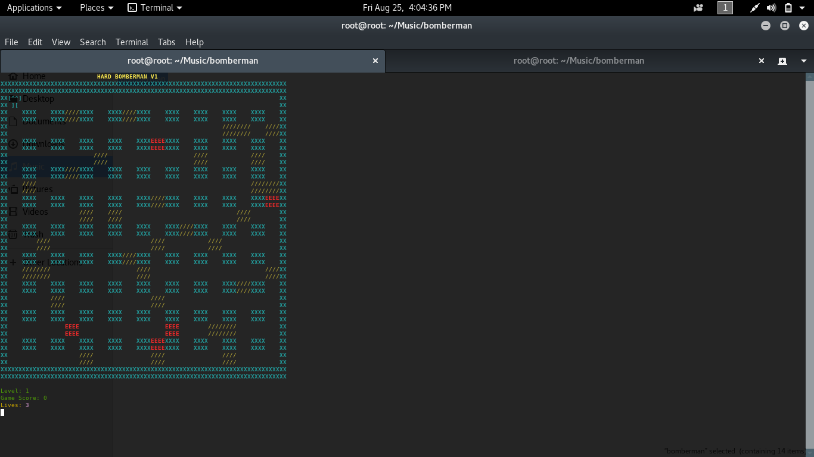

* Install grip to view README in offline mode.
```
sudo pip install grip
```
* [grip Usage](https://pypi.python.org/pypi/grip)
# A terminal based Bomberman game

  Implementation of Bomberman game using OOP Principles without using pygame and curses library.

# Screenshot


## Features

* Colourful environment.
* The bomb displays the time left for explosion.
* Implementation of extra LEVELs.
* Extra feature of Enemy trying to evade BOMBS.
* The bomberman won't die if he is standing at the place where he placed the bomb.
* 3 Lives for bomberman.

## Rules

* Bomberman can't destroy walls.
* Bomberman can destroy ENEMIES and bricks.
* Bomberman SCOREs 20 points if he destroys bricks.
* Bomberman SCOREs 100 points for killing ENEMIES.
* Bomberman has 3 lives.
* There are 5 dificulty LEVELs.

## Getting Started

These instructions will get you a copy of the project up and running on your local machine for development and testing purposes.


### Prerequisites

Things you need to install the software and instructions to install them:

* You should have python3 and pip3 installed:

First check if python3 is intstalled by using the command:

```
python3 -V
```

```
Output:
Python 3.5.3
```

If not installed then type the following:

```
sudo apt-get update
sudo apt-get -y update
```

* Instructions for installing pip

```
sudo apt-get install python3-pip
```

* You should have termcolor installed.

If not then type the following:

```
sudo pip3 install termcolor
```

## Deployment

* Just run python3 Main.py for starting the game on your terminal

## Controls

| Keys          | Movement      |
| ------------- |:-------------:|
| W             | Move Up       |
| A             | Move Left     |
| S             | Move Down     |
| D             | Move Right    |

* Press 'B' to Drop bomb
* Press 'q' to quit

## Symbols

| Symbols       | Meaning       |
| ------------- |:-------------:|
| E             | Enemy         |
| /             | Bricks        |
| W             | Walls         |
| e             | Explosion     |
| [^^]          |               |
|  ][           | Bomberman     |

## Built With

* [Python](https://www.python.org/)

## Authors

* **Sayak Kundu (20161035)**
